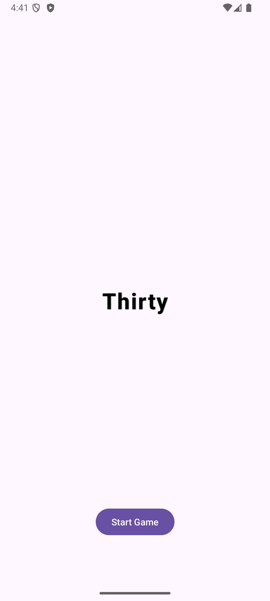

# Thirty

A mobile implementation of the dice game "Thirty".

## Game Description

Thirty is a dice game where players try to score as many points as possible by rolling dice and selecting combinations that sum up to a target number each round.

## How to Play

- The game is 10 rounds.
- In each round, you roll 6 dice.
- You can re-roll any number of dice up to two times per round.
- After rolling, select combinations of dice that sum up to the round's target number (e.g., 6, 7, 8, 9, 10, 11, or 12).
- Each valid combination scores points equal to the target number.
- The goal is to maximize your total score over all rounds.

## Rules

- Each die can only be used in one combination per round.
- You must use all dice to score in a round, or you score zero for unused dice.
- The game ends after 10 rounds and the player will see the score for each round and the total score.
- The goal is to get the highest score possible.

## Screenshots

### Start Screen
<p align="center">
  
</p>

### Game Screen
<p align="center">
  
  
</p>

### Result Screen
<p align="center">
  
</p>

## Installation

1. Clone the repository:
   ```sh
   git clone https://github.com/jonatanwestling/thirty.git
   ```
2. Open the project in Android Studio.
3. Build and run on an emulator or device.

## Credits

Developed by Jonatan Westling. 
